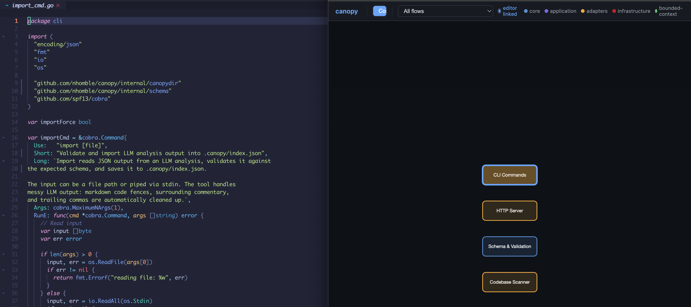

# canopy

see the forest from the trees

## About

CLI tool that uses LLMs to analyze codebases and generate architectural context. It is meant to be
viewed side by side during development.

## Usage

```bash
canopy init
canopy prepare-analysis . | claude --print | canopy import --force
canopy serve
```

## Demo


